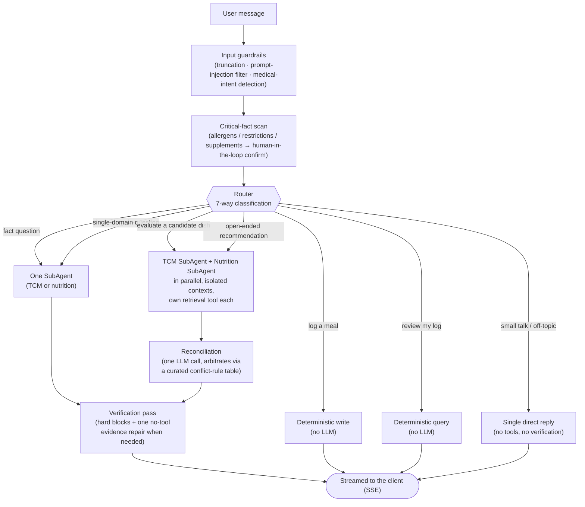

# Diet Expert

**A personal diet advisor that reconciles Traditional Chinese Medicine (TCM) dietary theory with modern nutrition science — instead of picking one and quietly ignoring the other.**

> Engineering demo, not a medical product. No diagnosis, treatment, or professional medical advice is provided or implied.

*(中文版见 [README.zh.md](./README.zh.md)，含更细的中文设计文档索引)*

---

## The problem

Ask "should I eat this" and today's options all fall short in the same way:

| Channel | Gap |
|---|---|
| Search / social media | Single-ingredient trivia, no whole-meal reasoning; quality is a lottery |
| General-purpose AI assistants | No memory across sessions, no live weather/season awareness, no citations |
| Diet-tracking apps | Count calories, have no concept of TCM food "nature" (hot/cold/neutral) |
| Friends & family | TCM intuition, but no nutrition science, no idea what supplements you're on |

A real answer to "what should I eat tonight" needs to weigh *your* constitution, *this week's* climate, *your* recent meals, and *your* supplements — none of which live in a search result.

**The differentiator isn't retrieval. It's reconciliation.** TCM and nutrition science frequently disagree — sometimes because they're actually right about different things, sometimes because they're talking about different concepts wearing the same name (TCM "replenishing blood" ≠ nutrition science "correcting iron-deficiency anemia" — same phrase, different referent). Most systems either present both sides and let the user guess, or silently defer to whichever domain the prompt happened to lean on. This one runs both domains, then arbitrates the conflict explicitly, against a hand-curated table of real TCM-vs-nutrition disagreements — not a model improvising an opinion on the spot.

## How it works



A few choices worth noting:

- **Isolated contexts, not one shared prompt.** TCM retrieval is qualitative and categorical ("warming," "nourishes blood"); nutrition retrieval is quantitative and unit-dense (mg, %DV). Mixed into one context, the quantitative side tends to squeeze the qualitative side into false precision, and vice versa. Each SubAgent reasons in its own 24k-token context with only its own retrieval tool, and returns a conclusion + citations — not raw chunks — to the reconciliation step.
- **Reconciliation is one dedicated, tool-free LLM call**, deliberately kept from touching raw retrieval results (so it can't quietly re-introduce the contamination the isolation was for). It checks a curated conflict-rule table first and is instructed to give a committed stance, not "both sides have a point."
- **Verification preserves useful output safely.** Hard allergen, ED, diagnostic, and initial citation-ID checks still block unsafe content. Evidence failures get one no-tool repair that removes unsupported specifics or explicitly labels bounded general knowledge; it never invents citations or reruns retrieval.
- **Tool access is role-scoped**, enforced by a local MCP-style server: the TCM SubAgent literally cannot call `write_memory` or see the nutrition retrieval tool — not by prompt instruction, but because the tool isn't in its session's whitelist.
- **Nothing here was picked because it "sounds more sophisticated."** The dual-agent design specifically was ablation-tested against a single-agent baseline with both retrieval tools in one context — see [Evaluation](#evaluation) below; the result was more interesting than either "obviously right" or "obviously wrong."

**Storage**: a single Postgres instance (pgvector for retrieval, plain tables for everything relational — user profile, diet log, conversation history, the conflict-rule table). No separate vector DB, no graph DB — see `docs/DECISIONS.md` D4/D23 for why.

## Status

This is an active engineering demo, not a finished product — status is tracked honestly stage-by-stage in [`docs/BUILD_PLAN.md`](./docs/BUILD_PLAN.md), not aspirationally. Summary:

| Stage | What it covers | Status |
|---|---|---|
| 1–3 | Naive RAG baseline, first eval dataset | ✅ Done |
| 4–6 | Core pipeline: routing, dual SubAgents, reconciliation, verification, SSE API, minimal frontend, guardrails, onboarding | ✅ Done |
| 7 | Session compression, dish-decomposition, critical-fact human-in-the-loop | ⚠️ Partial — standalone 3-day recipe assembly still missing |
| 8 | Full eval run, dual-tier (dev/delivery model) comparison, B2 architecture ablation | ⚠️ Partial — retrieval recall (M1) is 53.3%, below the 70% launch bar; see [Evaluation](#evaluation) |
| 9 | English README + architecture diagram, deployment | 🔶 This document + Docker self-host; no recorded walkthrough, no cloud deployment yet |

Two things intentionally **not** built, so they don't get assumed: a naive-RAG fallback when both SubAgents fail (currently a hard guardrail message instead), and a static fallback table for empty retrieval (the repair path may retain labelled general knowledge, but does not guess a source).

## Evaluation

Numbers live in [`docs/EVALUATION.md`](./docs/EVALUATION.md); the reasoning behind each architectural choice lives in [`docs/DECISIONS.md`](./docs/DECISIONS.md). One result worth highlighting here because it shows the methodology, not just the score:

**D1 asked whether splitting TCM/nutrition into two isolated agents actually beats a single agent with both retrieval tools in one context** — and pre-committed to reverting if it didn't hold up. It was tested twice, on the same 15 held-out conflict-resolution cases:

1. A keyword-match rubric initially showed the single-agent variant winning outright (40.0% vs 26.7% pass rate) — *and* using under half the LLM calls and wall-clock time.
2. Suspecting the keyword rubric was penalizing synonyms rather than measuring quality, a follow-up LLM-as-judge pass (five semantic dimensions, position-randomized to avoid bias) re-scored the *same* answers: content quality came back essentially tied (7.93/8 vs 8.00/8).

Conclusion actually shipped: the quality claim for two isolated agents is **unproven** on this data (not "disproven" — the first run overstated it), but the cost argument stands regardless of which framing you use — the single-agent variant reached the same quality for less than half the LLM calls. Whether to act on that in production is flagged as an open decision, not auto-applied — see the D1 revision notes in `DECISIONS.md` for the full reasoning, including what this evaluation *didn't* test (e.g., whether splitting the two domains makes failures easier to debug independently — a real engineering benefit no keyword or LLM-judge rubric captures).

## Quick start

### Option A — Docker (fastest way to see it running)

```bash
cp .env.example .env   # fill in at least one LLM provider — see below
docker compose up --build
```

Open **http://localhost:3000**. API health check: `GET http://localhost:8123/healthz`.

The knowledge-base vectors are **not** part of the startup path (embedding 5,837 chunks takes minutes to hours depending on hardware) — without them, `/healthz` is still green but chat answers fall back to a clearly labelled unverified response when citations are unavailable. See [`RUN.md`](./RUN.md) for the three ways to populate it (re-embed in-container, copy from an existing local Postgres, or embed on the host against the container's DB).

### Option B — Local development (hot reload)

```bash
docker compose up -d postgres        # Postgres + pgvector only
python3 -m venv .venv && source .venv/bin/activate
pip install -r requirements.txt
python3 db/load_conflict_rules.py    # seeds the 40-rule conflict table

uvicorn api.main:app --reload --host 127.0.0.1 --port 8123
```

```bash
# second terminal
cd frontend
cp .env.local.example .env.local
npm install && npm run dev
```

Full walkthrough, including what changes require a rebuild vs. hot-reload, lives in [`RUN.md`](./RUN.md) (Chinese; the commands themselves are copy-pasteable regardless).

### Configuring an LLM provider

At least one is required — without it, `/healthz` stays green but `/api/chat` fails. `MODEL_TIER=dev|prod` lets you point iteration and delivery traffic at different providers without touching code (`.env.example` has the full list):

| Provider | Cost | Notes |
|---|---|---|
| Ollama | Free | Local model, e.g. `ollama pull qwen3:0.6b` |
| OpenRouter | Pay-per-use, many free-tier models | One key, dozens of upstream models |
| OpenAI / Anthropic | Pay-per-use | Native API |

### Running the tests

```bash
pip install pytest httpx
pytest tests/          # unit + integration; LLM calls are mocked/replayed, no tokens burned, no API key needed
```

## Deployment

**What's real today**: `docker compose up` self-hosting (above) — that's the only deployment path that's actually been built and exercised.

**What isn't built**: a split cloud deployment (Vercel for the frontend, Render/Railway for the FastAPI backend, Neon for Postgres+pgvector) is a natural fit for this stack, but no config, guide, or test run for it exists yet in this repo — it's tracked as open Stage 9 work in `docs/BUILD_PLAN.md`, not claimed here as done.

## Repository layout

```
diet_expert/
├─ README.md / README.zh.md   this file / Chinese index
├─ RUN.md                     detailed run instructions (Chinese)
├─ docs/                      PRD, architecture, decision log, threat model, eval reports (Chinese)
├─ api/                       FastAPI app — /api/chat (SSE), /api/profile, /api/onboarding, /api/sessions, /api/users
├─ backend/                   pipeline: routing, SubAgents, reconciliation, verification, guardrails, memory, MCP tools, LLM adapter
├─ frontend/                  Next.js chat UI (SSE client, markdown rendering, multi-user switcher)
├─ db/                        schema.sql, ingest / embedding / conflict-rule loaders
├─ knowledge/                 knowledge-base source data (derived JSONL is gitignored)
├─ evals/                     frozen eval set, conflict-rule table, baseline + ablation runners
├─ tests/                     unit + integration (mocked/replayed LLM — no live API calls)
├─ docker-compose.yml
└─ .github/workflows/ci.yml   lint → test → smoke-eval
```

## Documentation index

The design documents are in Chinese (this repo's working language); this README is the English-facing summary layer on top of them.

| File | Answers |
|---|---|
| `docs/PRD.md` | What, and why |
| `docs/ARCHITECTURE.md` | Exactly what it looks like — function signatures, table schemas, request lifecycle |
| `docs/DECISIONS.md` | Why this choice over the alternative, including reversals when data disagreed |
| `docs/ENGINEERING.md` | Timeouts, degradation, testing, CI |
| `docs/ASYNC_DESIGN.md` | Agent async/sync layers, concurrency, known gaps and fix estimates |
| `docs/BUILD_PLAN.md` | Stage-by-stage build checklist, honestly marked |
| `docs/EVALUATION.md` | Metrics, thresholds, baseline and ablation numbers |
| `docs/THREAT_MODEL.md` | Failure/harm scenarios and current mitigation status |
