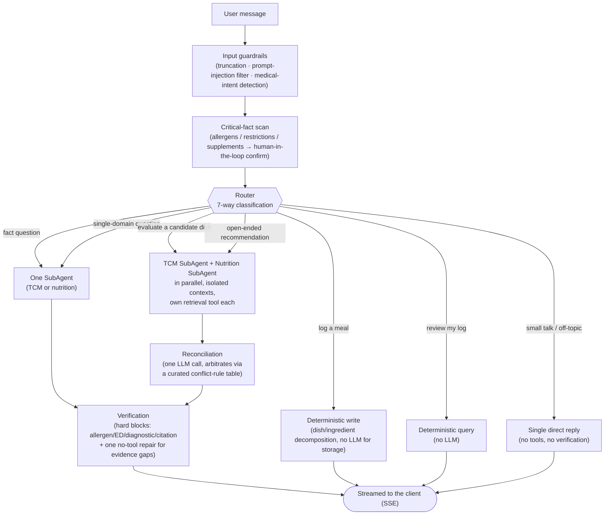

# Diet Expert

**A personal diet advisor that reconciles Traditional Chinese Medicine (TCM) dietary theory with modern nutrition science — instead of picking one and quietly ignoring the other.**

> Engineering demo, not a medical product. No diagnosis, treatment, or professional medical advice is provided or implied.

*(中文版见 [README.zh.md](./README.zh.md))*

---

## The problem

| Channel | Gap |
|---|---|
| Search / social media | Single-ingredient trivia, no whole-meal reasoning; quality is a lottery |
| General-purpose AI assistants | No memory across sessions, no live weather/season awareness, no citations |
| Diet-tracking apps | Count calories, have no concept of TCM food "nature" (hot/cold/neutral) |
| Friends & family | TCM intuition, but no nutrition science, no idea what supplements you're on |

A real answer to "what should I eat tonight" needs *your* constitution, *this week's* climate, *your* recent meals, and *your* allergens/supplements — none of which live in a search result.

**The differentiator isn't retrieval. It's reconciliation.** TCM and nutrition science frequently disagree — sometimes because they're right about different things, sometimes because they're talking about different concepts wearing the same name (TCM "replenishing blood" ≠ nutrition science "correcting iron-deficiency anemia" — same phrase, different referent). Most systems either present both sides and let the user guess, or silently defer to whichever domain the prompt happened to lean on. This one runs both domains, then arbitrates the conflict explicitly, against a hand-curated table of real TCM-vs-nutrition disagreements — not a model improvising an opinion on the spot.

## Product highlights

- **Two independent knowledge bases, not one blended one.** TCM food-therapy and nutrition science are retrieved and reasoned about separately (4,447 + 1,390 chunks, hybrid dense+sparse retrieval), then explicitly reconciled — not silently blended into one voice that quietly favors whichever domain happened to dominate the prompt.
- **A real constitution profile, not a self-report checkbox.** First-use onboarding runs a CCMQ-based questionnaire when the user doesn't already know their TCM constitution, computes primary + secondary types, and tags whether the result came from self-report or the questionnaire — so downstream advice can be appropriately more or less confident.
- **Allergen safety that doesn't rely on the model remembering.** Allergens — including hidden-ingredient cases like oyster sauce → shellfish — are cross-checked with deterministic code at the verification stage: a hard block, not a prompt instruction the model could skip. Logging a meal that happens to contain one still gets flagged, non-blocking (the meal already happened; refusing to log it helps no one).
- **Preferences and goals are modeled as different things.** "No cilantro" / "can't reheat lunch at the office" (constraints the plan must satisfy) are stored separately from "more energy" / "digestive comfort" (qualitative direction tags) — conflating them produces recommendations that satisfy neither.
- **Weather- and season-aware recommendations**, pulled live (Open-Meteo) rather than assumed from the calendar date.
- **Meal logging that actually parses what you ate.** Free text ("two eggs with lettuce and four pork dumplings") is decomposed into dishes → ingredients → TCM food-nature via a three-tier lookup (curated dish table → promoted personal aliases → LLM fallback), then is queryable by ingredient, property, or meal type — not just stored as a blob of text.
- **Cross-session memory.** Profile, diet log, and a tiered-compression conversation history persist in Postgres, not just in the current chat window.
- **Multi-user, bilingual (zh/en), each with their own timezone** — not a single hardcoded persona.

## Engineering highlights

- **Isolated dual-agent retrieval + role-scoped tool access.** TCM and nutrition SubAgents reason in separate 24k-token contexts, each with only its own retrieval tool — enforced by an MCP-style per-role whitelist, not a prompt instruction the model could ignore.
- **Deterministic-first routing.** A bilingual regex cascade classifies the seven request types; an LLM classifier is only consulted when no rule fires, so most traffic never pays for a classification call.
- **Reconciliation against a curated conflict-rule table**, not a model improvising an opinion — and deliberately forbidden from touching raw retrieval chunks, so it can't quietly re-introduce the cross-contamination the isolation exists to prevent.
- **A verification pass that can't be talked out of its hard blocks.** Allergens, eating-disorder-risk language, diagnostic claims, and citation validity are checked with deterministic code, not model judgment. Only genuine evidence-quality gaps (a citation that doesn't quite support its claim) get one no-tool repair pass that strips the unsupported part or labels it clearly as general knowledge — it never invents a citation or silently regenerates from scratch.
- **A hard streaming invariant, enforced by code structure, not convention:** verification always finishes before the first SSE token is sent — there is no code path that can stream unverified content to the client.
- **Human-in-the-loop for anything safety-critical.** A new allergen or supplement mentioned mid-conversation sits in a pending-confirmation queue; it is never silently merged into the profile the safety checks rely on.
- **Idempotent writes.** Logging the same meal twice within the same minute (a client retry, a double-tap) doesn't create a duplicate row — enforced by a hash-based idempotency key, not client-side debouncing.
- **1,100+ tests, zero live LLM calls in CI.** Every test that touches an LLM call uses a mocked or replayed response; the suite runs on every push without burning tokens or needing an API key.
- **A real evaluation harness, not a vibe check.** A frozen test set scored two independent ways — keyword rubric and LLM-as-judge — after the keyword rubric was caught penalizing correct-but-differently-worded answers. Architecture decisions (like the dual-agent split above) get pre-registered ablation tests with an explicit revert criterion, not just shipped on intuition.

## How it works



- **Isolated contexts, not one shared prompt.** TCM retrieval is qualitative and categorical ("warming," "nourishes blood"); nutrition retrieval is quantitative and unit-dense (mg, %DV). Mixed into one context, the quantitative side tends to squeeze the qualitative side into false precision, and vice versa. Each SubAgent returns a conclusion + citations — not raw chunks — to the reconciliation step.
- **Reconciliation is one dedicated, tool-free LLM call**, deliberately kept from touching raw retrieval results. It checks the conflict-rule table first and is instructed to give a committed stance, not "both sides have a point."
- **Storage is one Postgres instance** — pgvector for retrieval, plain tables for everything relational (profile, diet log, conversation history, conflict-rule table). No separate vector DB, no graph DB: pgvector already gives hybrid dense+sparse retrieval without adding a second system to operate.

## Evaluation

Frozen 40-case test set (factual retrieval, conflict reconciliation, multi-turn memory), scored on both a cheap iteration model and the real delivery-tier model, with two independent scoring methods cross-checked against each other because the first one turned out to be biased.

**Retrieval** — production path (hybrid dense + sparse over BGE-M3 embeddings, 5,837 chunks):

| | Recall@5 |
|---|---|
| BM25 keyword baseline | 53.3% |
| Production hybrid retrieval | **76.7%** — clears the 70% launch bar |

**Answer quality** — semantic pass = correct direction *and* no unsafe content, scored by an LLM-as-judge (position-randomized to avoid bias) after the keyword rubric was caught marking correct paraphrases wrong (e.g. failing "春天少酸、多吃甘淡" for not literally containing "少酸多甘"):

| | Dev-tier model | Delivery-tier model |
|---|---|---|
| TCM directional consistency | 93.3% | 66.7% — clears launch bar |
| Conflict-reconciliation correctness | 100% | 80.0% — clears launch bar |

**Architecture ablation.** Before committing to two isolated SubAgents over one agent sharing both retrieval tools, we tested it — with a pre-registered revert criterion. First pass (keyword rubric) showed the single-agent variant winning outright, using under half the LLM calls. Suspecting the rubric was penalizing synonyms, a semantic LLM-judge re-scored the *same* answers: quality came back statistically tied (7.93/8 vs 8.00/8). Honest read: the quality case for isolation is unproven on this data — but the cost argument (half the calls, half the latency) holds regardless of which scoring method you trust.

## Quick start

### Option A — Docker (fastest way to see it running)

```bash
cp .env.example .env   # fill in at least one LLM provider — see below
docker compose up --build
```

Open **http://localhost:3000**. API health check: `GET http://localhost:8123/healthz`.

The knowledge-base vectors are **not** part of the startup path (embedding 5,837 chunks takes minutes to hours depending on hardware) — without them, `/healthz` is still green but chat answers fall back to a clearly labelled unverified response when citations are unavailable. See [`RUN.md`](./RUN.md) for the three ways to populate it.

### Option B — Local development (hot reload)

```bash
docker compose up -d postgres        # Postgres + pgvector only
python3 -m venv .venv && source .venv/bin/activate
pip install -r requirements.txt
python3 db/load_conflict_rules.py    # seeds the 40-rule conflict table

uvicorn api.main:app --reload --host 127.0.0.1 --port 8123
```

```bash
# second terminal
cd frontend
cp .env.local.example .env.local
npm install && npm run dev
```

Full walkthrough, including what changes require a rebuild vs. hot-reload, lives in [`RUN.md`](./RUN.md).

### Configuring an LLM provider

At least one is required — without it, `/healthz` stays green but `/api/chat` fails. `MODEL_TIER=dev|prod` points iteration and delivery traffic at different providers without touching code (`.env.example` has the full list):

| Provider | Cost | Notes |
|---|---|---|
| Ollama | Free | Local model, e.g. `ollama pull qwen3:0.6b` |
| OpenRouter | Pay-per-use, many free-tier models | One key, dozens of upstream models |
| OpenAI / Anthropic | Pay-per-use | Native API |

### Running the tests

```bash
pip install pytest httpx
pytest tests/          # unit + integration; LLM calls are mocked/replayed, no tokens burned, no API key needed
```

## Repository layout

```
diet_expert/
├─ README.md / README.zh.md   this file / Chinese index
├─ RUN.md                     detailed run instructions
├─ docs/                      internal design notes (Chinese)
├─ api/                       FastAPI app — /api/chat (SSE), /api/profile, /api/onboarding, /api/sessions, /api/users
├─ backend/                   pipeline: routing, SubAgents, reconciliation, verification, guardrails, memory, MCP tools, LLM adapter
├─ frontend/                  Next.js chat UI (SSE client, markdown rendering, multi-user switcher)
├─ db/                        schema.sql, ingest / embedding / conflict-rule loaders
├─ knowledge/                 knowledge-base source data (derived JSONL is gitignored)
├─ evals/                     frozen eval set, conflict-rule table, baseline + ablation runners
├─ tests/                     unit + integration (mocked/replayed LLM — no live API calls)
├─ docker-compose.yml
└─ .github/workflows/ci.yml   lint → test → smoke-eval
```
