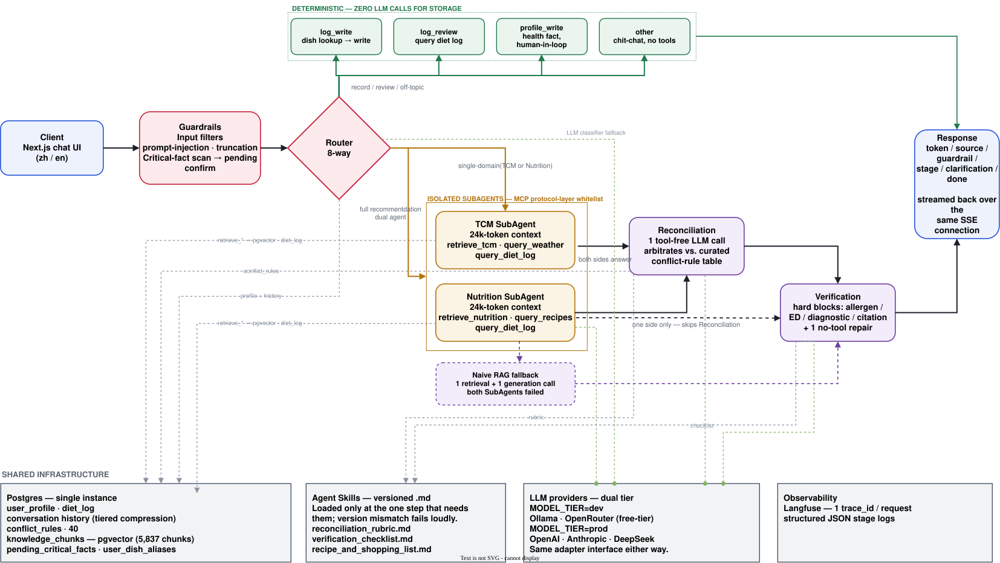

# Diet Expert

**A personal diet advisor that reconciles Traditional Chinese Medicine (TCM) dietary theory with modern nutrition science — instead of picking one and quietly ignoring the other.**

> Engineering demo, not a medical product. No diagnosis, treatment, or professional medical advice is provided or implied.

*(中文版见 [README.zh.md](./README.zh.md))*

---



One chat turn, left to right: guardrails and routing decide the path; the slow path isolates two SubAgents, retrieves, arbitrates, and verifies before anything streams back; Postgres, versioned Agent Skills, LLM providers, and Langfuse tracing support the pipeline from below. Full 8-branch routing decision logic (which regex/LLM classification sends a message down which path) is further down in [How it works](#how-it-works).

## The problem

| Channel | Gap |
|---|---|
| Search / social media | Single-ingredient trivia, no whole-meal reasoning; quality is a lottery |
| General-purpose AI assistants | No memory across sessions, no live weather/season awareness, no citations |
| Diet-tracking apps | Count calories, have no concept of TCM food "nature" (hot/cold/neutral) |
| Friends & family | TCM intuition, but no nutrition science, no idea what supplements you're on |

A real answer to "what should I eat tonight" needs *your* constitution, *this week's* climate, *your* recent meals, and *your* allergens/supplements — none of which live in a search result.

**The differentiator isn't retrieval. It's reconciliation.** TCM and nutrition science frequently disagree — sometimes because they're right about different things, sometimes because they're talking about different concepts wearing the same name (TCM "replenishing blood" ≠ nutrition science "correcting iron-deficiency anemia" — same phrase, different referent). Most systems either present both sides and let the user guess, or silently defer to whichever domain the prompt happened to lean on. This one runs both domains, then arbitrates the conflict explicitly, against a hand-curated table of real TCM-vs-nutrition disagreements — not a model improvising an opinion on the spot.

## Highlights

**Product**
- Two independent RAG knowledge bases (TCM + nutrition), reconciled explicitly, never blended
- CCMQ constitution questionnaire — primary + secondary type, tagged self-report vs. computed
- Deterministic allergen hard-block, including hidden-ingredient mapping (oyster sauce → shellfish)
- Preferences (hard constraints) modeled separately from goals (soft direction tags)
- Live weather- and season-aware recommendations (Open-Meteo)
- Free-text meal logging → dish/ingredient decomposition → queryable diet log
- Cross-session memory: profile, diet log, tiered-compressed conversation history
- Multi-user, bilingual (zh/en), each with their own timezone

**Engineering**
- Hybrid dense + sparse retrieval (BGE-M3 + RRF) with LLM multi-query expansion
- Isolated dual-agent SubAgents, tool access enforced by an MCP protocol-layer whitelist
- Versioned Agent Skills, composed in only at the one pipeline step that needs them
- Deterministic-first routing — LLM classifier only called when the regex cascade misses
- Reconciliation arbitrated against a curated 40-rule conflict table, not model improvisation
- Verification: deterministic hard blocks + one no-tool evidence repair, never blind regeneration
- Guardrails mapped line-by-line to the OWASP LLM Top 10, not a generic claim
- Streaming invariant enforced by code structure: verification always precedes the first token
- Human-in-the-loop confirmation gates every safety-critical profile write
- Idempotent writes via a hash-based key, not client-side debouncing
- 1,100+ tests, zero live LLM calls in CI
- Dual-tier eval harness (keyword rubric + LLM-as-judge) with pre-registered architecture ablations

<details>
<summary>Full technical detail behind each item</summary>

**Product**

- **Two independent RAG knowledge bases, not one blended one.** TCM food-therapy and nutrition science are retrieved and reasoned about separately (4,447 + 1,390 chunks), then explicitly reconciled — not silently blended into one voice that quietly favors whichever domain happened to dominate the prompt.
- **A real constitution profile, not a self-report checkbox.** First-use onboarding runs a CCMQ-based questionnaire when the user doesn't already know their TCM constitution, computes primary + secondary types, and tags whether the result came from self-report or the questionnaire — so downstream advice can be appropriately more or less confident.
- **Allergen safety that doesn't rely on the model remembering.** Allergens — including hidden-ingredient cases like oyster sauce → shellfish — are cross-checked with deterministic code at the verification stage: a hard block, not a prompt instruction the model could skip. Logging a meal that happens to contain one still gets flagged, non-blocking (the meal already happened; refusing to log it helps no one).
- **Preferences and goals are modeled as different things.** "No cilantro" / "can't reheat lunch at the office" (constraints the plan must satisfy) are stored separately from "more energy" / "digestive comfort" (qualitative direction tags) — conflating them produces recommendations that satisfy neither.
- **Weather- and season-aware recommendations**, pulled live (Open-Meteo) rather than assumed from the calendar date.
- **Meal logging that actually parses what you ate.** Free text ("two eggs with lettuce and four pork dumplings") is decomposed into dishes → ingredients → TCM food-nature via a three-tier lookup (curated dish table → promoted personal aliases → LLM fallback), then is queryable by ingredient, property, or meal type — not just stored as a blob of text.
- **Cross-session memory.** Profile, diet log, and a tiered-compression conversation history persist in Postgres, not just in the current chat window.
- **Multi-user, bilingual (zh/en), each with their own timezone** — not a single hardcoded persona.

**Engineering**

- **Hybrid RAG retrieval, not a single dense-vector lookup.** Each query runs dense + sparse search (BGE-M3's dual output) merged with Reciprocal Rank Fusion, plus multi-query expansion (an LLM rewrites the query into up to 2 alternate phrasings, each searched and fused in) to close the vocabulary gap between how a user asks and how the knowledge base is worded — with a silent fallback to single-query search if the rewrite call fails.
- **Isolated dual-agent retrieval + a real MCP tool layer.** TCM and nutrition SubAgents reason in separate 24k-token contexts. Tool access goes through a local Model Context Protocol (MCP) server with a per-role whitelist enforced at the protocol layer — the TCM SubAgent's session literally does not have `write_memory` or the nutrition retrieval tool in its tool list, so there's no prompt instruction to talk it out of.
- **Versioned Agent Skills, loaded only where they're needed.** The reconciliation rubric, verification checklist, and recipe-assembly template are separate versioned markdown files, not baked into the main system prompt — each is composed into the one call that needs it (reconciliation / verification / recipe assembly) and dropped everywhere else, so the router's own prompt stays small and a rubric change can't accidentally leak into an unrelated call. A version mismatch between the catalog and the file itself fails loudly at load time, not silently.
- **Deterministic-first routing.** A bilingual regex cascade classifies the seven request types; an LLM classifier is only consulted when no rule fires, so most traffic never pays for a classification call.
- **Reconciliation against a curated conflict-rule table**, not a model improvising an opinion — and deliberately forbidden from touching raw retrieval chunks, so it can't quietly re-introduce the cross-contamination the isolation exists to prevent.
- **A verification pass that can't be talked out of its hard blocks.** Allergens, eating-disorder-risk language, diagnostic claims, and citation validity are checked with deterministic code, not model judgment. Only genuine evidence-quality gaps (a citation that doesn't quite support its claim) get one no-tool repair pass that strips the unsupported part or labels it clearly as general knowledge — it never invents a citation or silently regenerates from scratch.
- **Guardrails mapped to the OWASP LLM Top 10, not ad hoc.** Prompt-injection filtering + data-not-instructions framing (LLM01), output interception on top of the verification hard blocks (LLM02), the MCP tool whitelist (LLM08 excessive agency), forced disclaimers with checkable citations (LLM09 overreliance), and a hard cap on SubAgent tool calls (15) and dispatch depth (2) against runaway consumption (LLM10) — each mapped to a specific line item, not a generic "we have guardrails" claim.
- **A hard streaming invariant, enforced by code structure, not convention:** verification always finishes before the first SSE token is sent — there is no code path that can stream unverified content to the client.
- **Human-in-the-loop for anything safety-critical.** A new allergen or supplement mentioned mid-conversation sits in a pending-confirmation queue; it is never silently merged into the profile the safety checks rely on.
- **Tiered memory compression with structured summaries, not free-text LLM summarization.** Older turns get folded into a fixed-template archive record (who/what/why, not a paragraph) specifically so they stay greppable/queryable later ("what was the allergen-blocked suggestion last time") — a fixed template can be searched deterministically, a free-text summary can't. Idle sessions fold further into a cross-session tier; unreferenced retrieval chunks are dropped outright rather than spending an LLM call summarizing something that didn't even make it into the final answer.
- **Idempotent writes.** Logging the same meal twice within the same minute (a client retry, a double-tap) doesn't create a duplicate row — enforced by a hash-based idempotency key, not client-side debouncing.
- **1,100+ tests, zero live LLM calls in CI.** Every test that touches an LLM call uses a mocked or replayed response; the suite runs on every push without burning tokens or needing an API key.
- **A real evaluation harness, not a vibe check.** A frozen test set scored two independent ways — keyword rubric and LLM-as-judge — after the keyword rubric was caught penalizing correct-but-differently-worded answers. Architecture decisions (like the dual-agent split above) get pre-registered ablation tests with an explicit revert criterion, not just shipped on intuition.

</details>

## How it works

- **Isolated contexts, not one shared prompt.** TCM retrieval is qualitative and categorical ("warming," "nourishes blood"); nutrition retrieval is quantitative and unit-dense (mg, %DV). Mixed into one context, the quantitative side tends to squeeze the qualitative side into false precision, and vice versa. Each SubAgent returns a conclusion + citations — not raw chunks — to the reconciliation step.
- **Reconciliation is one dedicated, tool-free LLM call**, deliberately kept from touching raw retrieval results. It checks the conflict-rule table first and is instructed to give a committed stance, not "both sides have a point."
- **Storage is one Postgres instance** — pgvector for retrieval, plain tables for everything relational (profile, diet log, conversation history, conflict-rule table). No separate vector DB, no graph DB: pgvector already gives hybrid dense+sparse retrieval without adding a second system to operate.
- **A real fallback when both SubAgents fail, not a dead end.** One retrieval pass per domain (no multi-query expansion, to keep it cheap) plus a single generation call, then reused through the same verification pass — degraded, but still grounded and checked, instead of a bare error.

## Evaluation

Frozen 40-case test set (factual retrieval, conflict reconciliation, multi-turn memory), scored on both a cheap iteration model and the real delivery-tier model, with two independent scoring methods cross-checked against each other because the first one turned out to be biased.

**Retrieval** — production path (hybrid dense + sparse over BGE-M3 embeddings, 5,837 chunks):

| | Recall@5 |
|---|---|
| BM25 keyword baseline | 53.3% |
| Production hybrid retrieval | **76.7%** — clears the 70% launch bar |

**Answer quality** — semantic pass = correct direction *and* no unsafe content, scored by an LLM-as-judge (position-randomized to avoid bias) after the keyword rubric was caught marking correct paraphrases wrong (e.g. failing "春天少酸、多吃甘淡" for not literally containing "少酸多甘"):

| | Dev-tier model | Delivery-tier model |
|---|---|---|
| TCM directional consistency | 93.3% | 66.7% — clears launch bar |
| Conflict-reconciliation correctness | 100% | 80.0% — clears launch bar |

**Architecture ablation.** Before committing to two isolated SubAgents over one agent sharing both retrieval tools, we tested it — with a pre-registered revert criterion. First pass (keyword rubric) showed the single-agent variant winning outright, using under half the LLM calls. Suspecting the rubric was penalizing synonyms, a semantic LLM-judge re-scored the *same* answers: quality came back statistically tied (7.93/8 vs 8.00/8). Honest read: the quality case for isolation is unproven on this data — but the cost argument (half the calls, half the latency) holds regardless of which scoring method you trust. This tested answer quality per dollar on a narrow 15-case sample — it didn't (and structurally can't, via either rubric) test the separate engineering rationale for isolation: independently debugging and evaluating each domain when something goes wrong.

## Quick start

### Option A — Docker (fastest way to see it running)

```bash
cp .env.example .env   # fill in at least one LLM provider — see below
docker compose up --build
```

Open **http://localhost:3000**. API health check: `GET http://localhost:8123/healthz`.

The knowledge-base vectors are **not** part of the startup path (embedding 5,837 chunks takes minutes to hours depending on hardware) — without them, `/healthz` is still green but chat answers fall back to a clearly labelled unverified response when citations are unavailable.

**Populate retrieval (recommended, ~30s):** download the pre-built snapshot from [GitHub Releases](https://github.com/jeyqc6/tcm_diet_expert/releases/tag/v0.1.0-kb) and import:

```bash
docker compose up -d postgres   # if not already running
./scripts/import_knowledge_chunks.sh
```

The script auto-downloads `knowledge_chunks.sql.gz` (~34 MB, 5,837 rows) into `data/` (gitignored) and loads it into Docker Postgres. Other options (re-embed from JSONL, `pg_dump` from an existing DB) are in [`RUN.md`](./RUN.md) §1.2.

### Option B — Local development (hot reload)

```bash
docker compose up -d postgres        # Postgres + pgvector only
python3 -m venv .venv && source .venv/bin/activate
pip install -r requirements.txt
python3 db/load_conflict_rules.py    # seeds the 40-rule conflict table

uvicorn api.main:app --reload --host 127.0.0.1 --port 8123
```

```bash
# second terminal
cd frontend
cp .env.local.example .env.local
npm install && npm run dev
```

Full walkthrough, including what changes require a rebuild vs. hot-reload, lives in [`RUN.md`](./RUN.md). **Free VPS deploy (Oracle + docker compose):** [`RUN.md` §4](./RUN.md#4-vps-部署方案-a--免费-oracle-单机).

### Configuring an LLM provider

At least one is required — without it, `/healthz` stays green but `/api/chat` fails. `MODEL_TIER=dev|prod` points iteration and delivery traffic at different providers without touching code (`.env.example` has the full list):

| Provider | Cost | Notes |
|---|---|---|
| Ollama | Free | Local model, e.g. `ollama pull qwen3:0.6b` |
| OpenRouter | Pay-per-use, many free-tier models | One key, dozens of upstream models |
| OpenAI / Anthropic | Pay-per-use | Native API |

### Running the tests

```bash
pip install pytest httpx
pytest tests/          # unit + integration; LLM calls are mocked/replayed, no tokens burned, no API key needed
```

## Try it

Once it's running, each of these hits a different branch of the pipeline above — worth trying a few back to back to see the routing actually change behavior, not just the wording of the answer:

| Try asking | What happens |
|---|---|
| "What should I eat tonight?" | **Full recommendation** — both SubAgents run in parallel, get reconciled against the conflict-rule table, and stream back as one grounded answer with citations |
| "The restaurant downstairs has mapo tofu and rice noodles — which one should I pick?" | **Candidate evaluation** — judges the given options instead of generating a plan from scratch |
| "What is the TCM nature of ginger?" | **Fact lookup** — one SubAgent, one retrieval call, no reconciliation needed |
| "What should someone with qi deficiency eat?" | **Single-domain** — routed to the TCM SubAgent only; nutrition isn't consulted at all |
| "I had two eggs and toast for breakfast, log it" | **Deterministic write** — dish/ingredient decomposition, no generation |
| "What did I eat yesterday?" | **Deterministic query** against the diet log — zero LLM calls |
| "By the way, I'm allergic to shrimp" | **Critical-fact scan** fires mid-conversation — sits in a pending-confirmation queue instead of silently rewriting your profile |

Works in Chinese too (the router and both knowledge bases are bilingual) — e.g. "今天该吃什么" / "我对虾过敏".

### Real transcripts

Unedited output from actual runs against a live profile (constitution, allergens, and diet log already on file) — not cherry-picked copy, just what came back.

<details>
<summary><b>Candidate evaluation</b> — the exact "mapo tofu vs. rice noodles" example from the table above</summary>

> **You:** The restaurant downstairs has mapo tofu and rice noodles — which one should I pick?
>
> **Diet Expert:** I need to know:
> 1. For mapo tofu: Is it the standard version (silken tofu in spicy chili oil with ground pork/beef)? And will you be eating it with rice or noodles?
> 2. For rice noodles: What style — is it a soup-based dish, stir-fried, or cold? What proteins and vegetables come with it?
>
> These details matter for the TCM food therapy assessment, since the preparation method, temperature, and accompanying ingredients significantly affect how the dish interacts with your digestion and energy levels.
>
> **You:** 1 yes, 2 stir-fried
>
> **Diet Expert:** **Stir-Fried Rice Noodles — Your Better Choice Today.** Go with the stir-fried rice noodles. Both perspectives — traditional food therapy and nutritional science — point the same direction here, though for slightly different reasons.
>
> *Why both angles agree:* From a food therapy standpoint, mapo tofu's heavy chili oil creates sustained heat that can overstimulate digestion if eaten too frequently. Your balanced constitution gives you flexibility with spicy foods, but the principle is to alternate between warming and neutral preparations rather than loading every meal with maximum heat. Stir-fried rice noodles, cooked through dry wok heat, deliver a gentler warmth without that inflammatory load. From a nutritional angle, rice noodles have a moderate glycemic index (54–61) — they release energy gradually, especially when paired with protein and oil from the stir-fry.
>
> *How to get the spice you want:* You clearly don't want bland food, so don't settle for plain noodles. Ask for the stir-fried noodles to be made with chili oil, or request hot sauce on the side.
>
> Bottom line: Stir-fried rice noodles satisfy your need for stable energy release and your taste for heat. Save mapo tofu for another meal when you want bold spice as a deliberate choice.
>
> *General model knowledge; not verified against the current knowledge base and may be inaccurate.*

Note the disclaimer on the last line — this answer leaned on general reasoning rather than a knowledge-base citation, and the system labels that difference instead of presenting both the same way.

</details>

<details>
<summary><b>Fact lookup + multi-turn follow-up</b> — same session, second question references the first with no re-explanation</summary>

> **You:** What is the TCM nature of ginger? Is it helpful to eat ginger in the food, although I don't like the taste of ginger.
>
> **Diet Expert:** **TCM nature of ginger:** Ginger is warm in nature and acrid (spicy) in flavor. **Primary functions:** warm the middle (stomach), descend qi, transform dampness, and resolve phlegm.
>
> Given your balanced (ping he) constitution, ginger is generally supportive. However, if you actively dislike the taste, forcing yourself to eat it regularly creates a psychological friction that undermines the benefit. Food therapy works best when you can sustain the habit without resistance.
>
> - Don't force ginger if you genuinely dislike it — your balanced constitution doesn't require it the way someone with cold-deficiency patterns might.
> - Use it strategically in small amounts: hide thin slices in soups or broths where the flavor blends into the background.
> - Or skip it — garlic, onion, or the cooking method itself can warm your food without a flavor you fight against.
>
> **You:** how to understand descend qi, transform dampness?
>
> **Diet Expert:** **"Descend Qi" (下气):** qi can become stuck or stagnant, rising upward when it should move smoothly downward — traditionally associated with bloating, nausea, or fullness in the chest. "Descend qi" means ginger is traditionally understood to help redirect stuck energy downward.
>
> **"Transform Dampness" (化湿):** "dampness" is an imbalance where the body accumulates excess, sluggish fluid — not the same as drinking water, but a thick, heavy, stagnant quality in digestion. "Transform dampness" means ginger is traditionally understood to help break up that heavy, stagnant moisture.
>
> For your balanced constitution, this is supportive but not urgent — you don't have a pattern that desperately needs it.

The second question never re-mentions "ginger" — it's resolved from the same session's conversation history, not re-explained from scratch.

</details>

<details>
<summary><b>Multi-day planning</b> — reads the existing diet log and season, not just the question asked</summary>

> **You:** I might want to have KFC once in the next three days. Could you help me design a meal plan for the next three days? I only eat lunch and dinner each day, and sometimes I skip lunch.
>
> **Diet Expert:** **Your 3-Day Meal Plan with KFC.** Looking at your diet log and preferences, I can see you thrive on warm, bold flavors. You're moving into autumn, when it's smart to add more vegetables and hydration-supporting foods without making everything bland. Here's how to include KFC while keeping your energy and digestion steady:
>
> **Day 1 — KFC Day.** Dinner: KFC meal. *Pairing strategy:* if KFC has a side salad or coleslaw, grab it; if not, add a quick side of steamed bok choy with garlic — this slows digestion and reduces the heaviness that comes from fried food alone.
>
> **Day 2 — Recovery & Balance.** Lunch: egg fried rice with mixed vegetables. Dinner: pork rib + winter melon soup with rice — winter melon is cooling and light, and soup-based meals help digestion bounce back.
>
> **Day 3 — Back to Your Bold Flavors.** Dinner: stir-fried chicken or pork with peppers and onions, seasoned boldly (garlic, soy sauce, chili oil). *Why stir-fry instead of deep-fry:* same warmth and spice, but a gentler cooking method that adds vegetables naturally.
>
> *Why this pattern works:* sandwich fried food between lighter meals — the day after KFC, favor soup-based and steamed preparations. This isn't about eliminating spice or richness, it's about method and timing. Your recent log is light on greens, which is why vegetables show up in every day above.

Trimmed here for length — the full reply also included a shopping list and ingredient-level reasoning for each swap.

</details>

## Repository layout

```
diet_expert/
├─ README.md / README.zh.md   this file / Chinese index
├─ RUN.md                     detailed run instructions
├─ docs/                      internal design notes (Chinese)
├─ api/                       FastAPI app — /api/chat (SSE), /api/profile, /api/onboarding, /api/sessions, /api/users
├─ backend/                   pipeline: routing, SubAgents, reconciliation, verification, guardrails, memory, MCP tools, LLM adapter
├─ frontend/                  Next.js chat UI (SSE client, markdown rendering, multi-user switcher)
├─ db/                        schema.sql, ingest / embedding / conflict-rule loaders
├─ knowledge/                 knowledge-base source data (derived JSONL is gitignored)
├─ evals/                     frozen eval set, conflict-rule table, baseline + ablation runners
├─ tests/                     unit + integration (mocked/replayed LLM — no live API calls)
├─ docker-compose.yml
└─ .github/workflows/ci.yml   lint → test → smoke-eval
```
