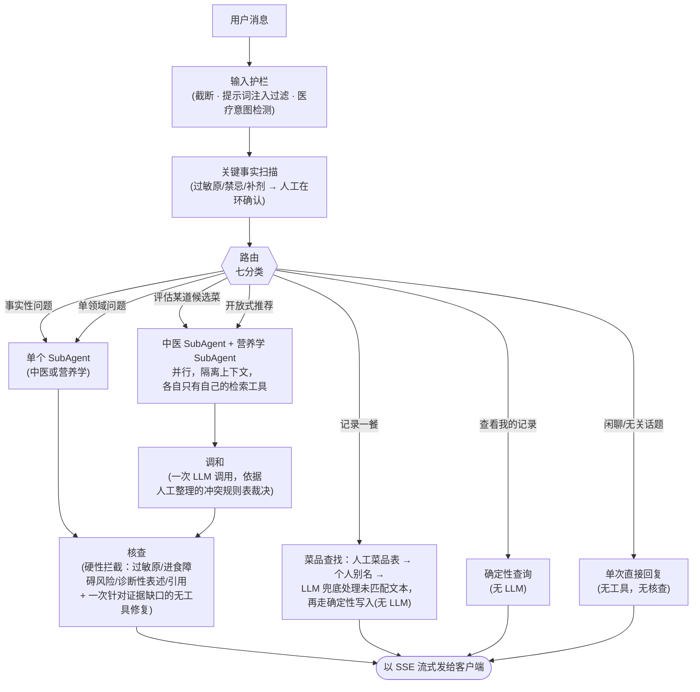

# Diet Expert

**一个把中医食疗理论和现代营养学真正调和在一起的个人饮食顾问——而不是选一边、悄悄忽略另一边。**

> 工程演示项目，不是医疗产品。不提供也不暗示任何诊断、治疗或专业医疗建议。

*(English version: [README.md](./README.md))*

---

## 要解决的问题

| 渠道 | 缺口 |
|---|---|
| 搜索 / 社交媒体 | 只有单一食材的零碎知识，没有整餐层面的推理；质量全看运气 |
| 通用 AI 助手 | 没有跨会话记忆，不感知实时天气/季节，没有引用来源 |
| 饮食记录 App | 只算卡路里，没有中医「食性」（寒热温凉平）的概念 |
| 亲友 | 有中医直觉，但没有营养学知识，也不知道你在吃什么补剂 |

回答「今晚吃什么」这个问题，真正需要的是**你的**体质、**这一周**的气候、**你**最近吃了什么、**你**的过敏原和补剂——这些都不会出现在一条搜索结果里。

**这个项目的差异化不在检索，而在调和。** 中医和营养学经常意见相左——有时是因为它们各自说对了不同的事，有时是因为它们用同一个词指代不同的概念（中医的「补血」≠ 营养学的「纠正缺铁性贫血」——同一个词，不同的所指）。大多数系统要么把两边观点都摆出来让用户自己猜，要么悄悄偏向 prompt 里恰好占上风的那一方。这个项目分别跑两个领域，然后针对一张人工整理的中医-营养学真实冲突表，显式地裁决冲突——不是模型临场编一个态度。

## 产品亮点

- **两个独立的 RAG 知识库，而不是混在一起的一个。** 中医食疗和营养学分别检索、分别推理（4,447 + 1,390 个片段），再显式调和——而不是悄悄混成一种腔调，让恰好在 prompt 里占上风的领域说了算。
- **真正的体质档案，不是自填勾选框。** 用户不知道自己中医体质时，首次使用会跑一份基于 CCMQ 的问卷，算出主/次体质类型，并标注这个结果来自自报还是问卷——下游建议因此可以相应地更自信或更保守。
- **过敏安全不依赖模型「记得住」。** 过敏原——包括蚝油→贝类这类隐藏成分——在核查阶段用确定性代码交叉检查：这是硬性拦截，不是模型可能跳过的 prompt 指令。记录一餐恰好含有过敏原时仍会被标记，但不阻塞（饭已经吃了，拒绝记录帮不了任何人）。
- **偏好和目标被建模成两种不同的东西。**「不要香菜」/「公司没法热午饭」这类约束（计划必须满足的硬条件）和「更有精神」/「肠胃更舒服」这类方向性标签分开存储——把两者混为一谈，产出的建议哪边都满足不了。
- **感知天气和季节的建议**，实时拉取（Open-Meteo），而不是从日历日期臆测。
- **真正解析你吃了什么的饮食记录。** 自由文本（「两个鸡蛋配生菜和四个猪肉水饺」）通过三级查找（人工整理的菜品表 → 提升为个人别名 → LLM 兜底）被拆解成菜品 → 食材 → 中医食性，之后可按食材、属性或餐次查询——不只是存成一段文本。
- **跨会话记忆。** 档案、饮食记录、分层压缩的对话历史都持久化在 Postgres 里，不只存在于当前这个聊天窗口。
- **多用户、中英双语，各自有独立时区**——不是写死的单一人设。

## 工程亮点

- **混合 RAG 检索，不是单一的稠密向量查找。** 每次查询同时跑稠密+稀疏检索（BGE-M3 的双路输出），用 Reciprocal Rank Fusion 融合，再加多查询扩展（LLM 把查询改写成最多 2 个备选说法，各自检索后融合进来），用来弥合用户提问方式和知识库措辞之间的词汇差距——改写调用失败时会静默降级为单查询检索。
- **隔离的双 Agent 检索 + 按角色限定工具访问。** 中医和营养学两个 SubAgent 在各自独立的 24k token 上下文里推理，各自只能访问自己的检索工具——由 MCP 风格的按角色白名单强制，不是模型可以忽略的 prompt 指令。
- **确定性优先的路由。** 一套双语正则级联先对七种请求类型分类；只有没有规则命中时才会调用 LLM 分类器，所以大多数流量不用为分类调用付费。
- **针对人工整理的冲突规则表做调和**，不是模型临场编一个观点——而且刻意禁止直接接触原始检索片段，这样它就不能悄悄重新引入「隔离」本该防止的跨域污染。
- **一套说不动的硬性核查拦截。** 过敏原、饮食失调风险话语、诊断性表述、引用有效性都用确定性代码检查，不靠模型判断。只有真正的证据质量缺口（引用没能完全支撑其论点）才会触发一次无工具的修复通道，剥离站不住脚的部分或明确标注为通用知识——绝不会编造引用或悄悄从头重新生成。
- **一条由代码结构强制的硬流式不变量：** 核查永远在第一个 SSE token 发出之前完成——没有任何代码路径能把未经核查的内容流给客户端。
- **安全相关的一切都有人工在环。** 对话中途提到的新过敏原或补剂会先进待确认队列；绝不会被悄悄合并进安全检查所依赖的档案。
- **幂等写入。** 同一分钟内重复记录同一餐（客户端重试、误触两次）不会产生重复行——靠哈希幂等键保证，不是靠前端防抖。
- **1,100+ 个测试，CI 里零真实 LLM 调用。** 每个涉及 LLM 调用的测试都用 mock 或回放的响应；测试套件每次 push 都跑，不烧 token 也不需要 API key。
- **一套真正的评测框架，不是凭感觉。** 一份冻结测试集用两种独立方式打分——关键词打分表和 LLM-as-judge——起因是关键词打分表被抓到会误判正确但换了说法的答案。架构决策（比如上面的双 Agent 拆分）都要经过预先登记好回退标准的 ablation 测试，不是靠直觉直接上线。

## 工作原理



- **隔离的上下文，不是一个共享 prompt。** 中医检索是定性、分类式的（「温性」「补血」）；营养学检索是定量、单位密集的（mg、%DV）。混在同一个上下文里，定量的一侧往往会把定性的一侧挤压成假性精确，反过来也一样。每个 SubAgent 向调和步骤返回的是结论+引用——不是原始片段。
- **调和是一次专门的、不带工具的 LLM 调用**，刻意不让它接触原始检索结果。它先查冲突规则表，被要求给出一个明确立场，而不是「双方都有道理」。
- **存储只用一个 Postgres 实例**——pgvector 做检索，普通表做其余一切关系型数据（档案、饮食记录、对话历史、冲突规则表）。没有单独的向量数据库，也没有图数据库：pgvector 本身就能给出稠密+稀疏混合检索，不需要多运维一套系统。

## 评测

冻结的 40 例测试集（事实检索、冲突调和、多轮记忆），分别在一个便宜的迭代模型和真正上线用的模型上跑分，两种独立打分方式互相交叉验证——因为第一种打分方式后来被发现有偏差。

**检索** —— 生产路径（在 BGE-M3 嵌入上做稠密+稀疏混合检索，5,837 个片段）：

| | Recall@5 |
|---|---|
| BM25 关键词基线 | 53.3% |
| 生产环境混合检索 | **76.7%** —— 超过 70% 的上线门槛 |

**回答质量** —— 语义通过 = 方向正确 **且** 没有不安全内容，由 LLM-as-judge 打分（位置随机化以避免偏向），起因是关键词打分表被抓到把正确的改写答案判错（比如「春天少酸、多吃甘淡」因为没有逐字包含「少酸多甘」而被判失败）：

| | 迭代档模型 | 上线档模型 |
|---|---|---|
| 中医方向一致性 | 93.3% | 66.7% —— 超过上线门槛 |
| 冲突调和正确率 | 100% | 80.0% —— 超过上线门槛 |

**架构 ablation。** 在决定用两个隔离的 SubAgent、而不是一个共享两个检索工具的单 Agent 之前，我们做了测试——并预先登记了回退标准。第一轮（关键词打分表）显示单 Agent 方案完胜，且只用了不到一半的 LLM 调用次数。怀疑打分表在惩罚同义改写，于是用语义化的 LLM-judge 对**同一批**答案重新打分：质量在统计意义上打平了(7.93/8 vs 8.00/8)。诚实的结论是：在这份数据上，隔离带来质量提升的说法站不住脚——但成本论证（一半的调用次数、一半的延迟）不管信哪种打分方式都成立。这个测试衡量的是在一份 15 例的小样本上「每一美元换来的回答质量」——它没有、而且不管用哪种打分方式都无法测试隔离架构另一条独立的工程理由：出问题时能不能分别调试和评测每个领域。

## 快速开始

### 方案 A —— Docker（最快看到跑起来）

```bash
cp .env.example .env   # 至少填一个 LLM provider —— 见下面
docker compose up --build
```

打开 **http://localhost:3000**。API 健康检查：`GET http://localhost:8123/healthz`。

知识库向量**不在**这条启动路径上（嵌入 5,837 个片段视硬件不同要几分钟到几小时）——不灌库时 `/healthz` 仍是绿的，但没有引用来源可用时聊天会降级为明确标注的未核实回答。三种灌库方式见 [`RUN.md`](./RUN.md)（推荐用预生成的 Release 快照，约 30 秒导入）。

### 方案 B —— 本地开发（热更新）

```bash
docker compose up -d postgres        # 只起 Postgres + pgvector
python3 -m venv .venv && source .venv/bin/activate
pip install -r requirements.txt
python3 db/load_conflict_rules.py    # 灌 40 条冲突规则表

uvicorn api.main:app --reload --host 127.0.0.1 --port 8123
```

```bash
# 另开一个终端
cd frontend
cp .env.local.example .env.local
npm install && npm run dev
```

完整流程，包括哪些改动要重新构建、哪些能热更新，见 [`RUN.md`](./RUN.md)。

### 配置 LLM provider

至少要配一个——不配的话 `/healthz` 仍然是绿的，但 `/api/chat` 会报错。`MODEL_TIER=dev|prod` 让迭代流量和上线流量指向不同 provider，不用改代码（完整列表见 `.env.example`）：

| Provider | 成本 | 说明 |
|---|---|---|
| Ollama | 免费 | 本地模型，例如 `ollama pull qwen3:0.6b` |
| OpenRouter | 按量计费，部分模型免费 | 一个 key 转发到几十家上游模型 |
| OpenAI / Anthropic | 按量计费 | 原生 API |

### 跑测试

```bash
pip install -r requirements.txt   # pytest / httpx 已包含在内
pytest tests/          # 单元+集成；LLM 调用全 mock/回放，不烧 token，不需要 API key
```

## 仓库结构

```
diet_expert/
├─ README.md / README.zh.md   英文版 / 本文件(中文版)
├─ RUN.md                     详细运行说明
├─ docs/                      内部设计文档(中文)
├─ api/                       FastAPI 应用 —— /api/chat (SSE)、/api/profile、/api/onboarding、/api/sessions、/api/users
├─ backend/                   管线：路由、SubAgent、调和、核查、护栏、记忆、MCP 工具、LLM adapter
├─ frontend/                  Next.js 聊天界面(SSE 客户端、markdown 渲染、多用户切换)
├─ db/                        schema.sql、ingest / embedding / 冲突规则加载器
├─ knowledge/                 知识库源数据(派生 JSONL 在 .gitignore 里)
├─ evals/                     冻结评测集、冲突规则表、baseline + ablation 跑分脚本
├─ tests/                     单元 + 集成(LLM 全 mock/回放，无真实调用)
├─ docker-compose.yml
└─ .github/workflows/ci.yml   lint → test → smoke-eval
```
